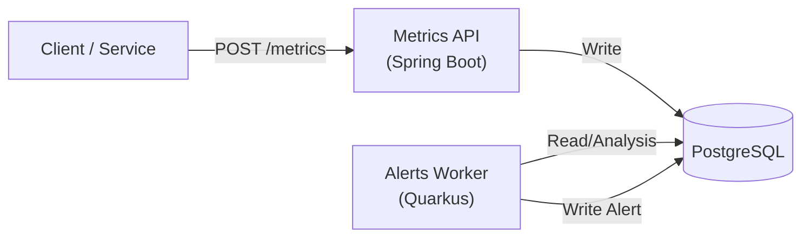

# metrics-platform


A cloud-native observability platform demonstrating high-performance REST APIs, event-driven architecture, and modern DevOps practices. Designed to align with enterprise-grade Java development standards.

---

## 📖 Overview

The **Metrics Platform** is a distributed system for ingesting, storing, and analyzing service metrics. It leverages a hybrid microservices architecture:

*   **Ingest API (Spring Boot)**: High-throughput REST endpoint for receiving metric data.
*   **Alerts Worker (Quarkus)**: Lightweight, native-capable worker for processing metrics and generating alerts.
*   **Storage (PostgreSQL)**: Relational storage for metrics and alert history.
*   **Infrastructure**: Fully containerized (Docker) and orchestrated on Kubernetes.

## 🏗 Architecture



### Components
| Component | Tech Stack | Responsibility | Internal Port |
|-----------|------------|----------------|---------------|
| **metrics-platform-api** | Java 21, Spring Boot 3, Hibernate | Ingests metrics, validates data, exposes stats API | `8080` |
| **metrics-platform-alerts-worker** | Java 21, Quarkus, Panache | periodic analysis (30s), alerting logic | `8080` |
| **PostgreSQL** | PostgreSQL 16 | Persistent storage for `metric_records` and `alerts` | `5432` |

**Note on Ports:** Both services listen on port `8080` internally within their respective pods. Kubernetes assigns unique IPs to each pod, preventing conflicts. Only the API service is typically exposed externally.

---

## 🚀 Quickstart

### Prerequisites
*   **Docker Desktop** (or Engine)
*   **Minikube** (for local K8s)
*   **Java 21** (optional, for local dev)

### One-Command Setup
The project includes a unified development script that builds images and deploys to Minikube:

```bash
./scripts/dev-up.sh
```

**What this does:**
1.  Starts Minikube.
2.  Builds Docker images for API and Worker.
3.  Applies K8s manifests (Namespace, ConfigMaps, Deployments, Services).
4.  Waits for pods to be ready.
5.  Exposes the API service URL.

### Verification
Check the running pods:
```bash
kubectl get pods -n metrics-platform
```

**Expected Output:**
```text
NAME                             READY   STATUS    RESTARTS   AGE
alerts-worker-587f5886c8-d72jb   1/1     Running   0          2m
metrics-api-6cf95c7f55-992fq     1/1     Running   0          2m
postgres-6dfc9cdc8c-m44f7        1/1     Running   0          2m
```

Test the Ingest API:
```bash
curl -X POST $(minikube service metrics-api -n metrics-platform --url)/metrics \
  -H "Content-Type: application/json" \
  -d '{"serviceName":"test-service", "latencyMs": 150, "statusCode": 200, "timestamp": "2024-01-01T12:00:00Z"}'
```

---

## 🧪 Testing

### Unit & Integration Tests
Run the standard Maven verification suite:
```bash
./mvnw clean verify
```

### Load Testing (JMeter)
Run a performance test (100-1000 users ramp-up) against the local cluster:
```bash
./scripts/run-jmeter-tests.sh
```
*   Generates an HTML dashboard in `test-reports/`
*   Measures throughput, latency, and error rates.

---

## 🤝 Role Alignment
This project is explicitly designed to reflect the responsibilities of the **Software Engineer** role (Job ID: R-053448) at **Red Hat**.

*   **REST APIs with Java/Spring**: Implemented scalable, high-performance endpoints (`metrics-platform-api`).
*   **Cloud-Native Java (Quarkus)**: Used for the worker node to demonstrate lightweight, fast-boot runtime capabilities (`metrics-platform-alerts-worker`).
*   **Postgres + NoSQL**: Utilizes PostgreSQL for structured data (NoSQL integration planned).
*   **Docker + Kubernetes**: Production-ready `Dockerfile` (multi-stage, non-root) and K8s manifests (`Deployment`, `Service`, `ConfigMap`, `Secret`).
*   **Performance Testing**: Integrated **JMeter** suite for load validation.
*   **CI/CD**: Full pipelines defined in **GitHub Actions** and **Jenkinsfile** (Jenkins w/ Kubernetes agents).

**References:**
*   [Red Hat Job R-053448](https://redhat.wd5.myworkdayjobs.com/en-US/Jobs/job/Software-Engineer_R-053448)
*   [Red Hat Best Practices for Kubernetes](https://redhat-best-practices-for-k8s.github.io/guide/)
